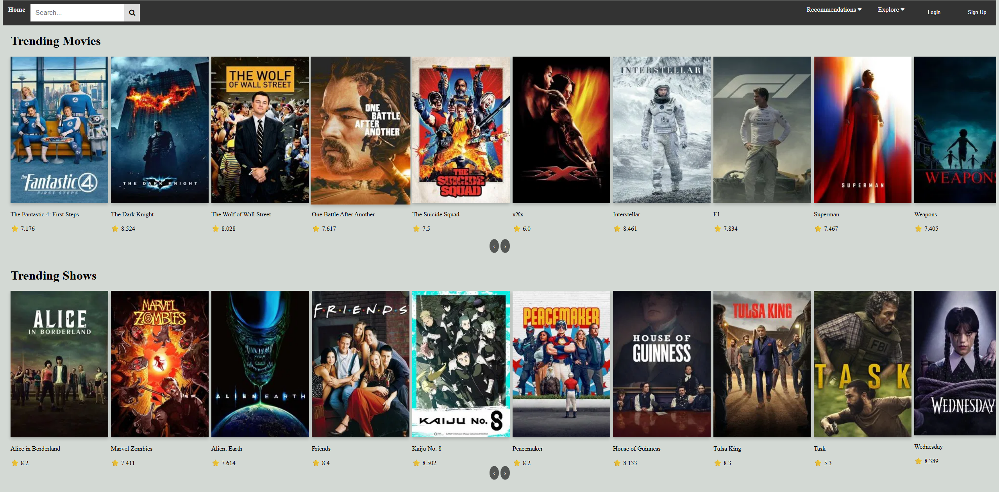
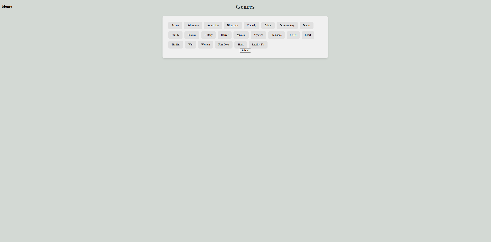
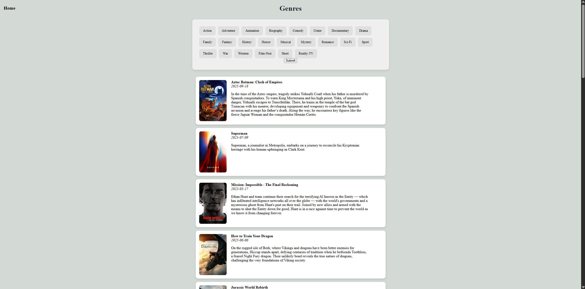
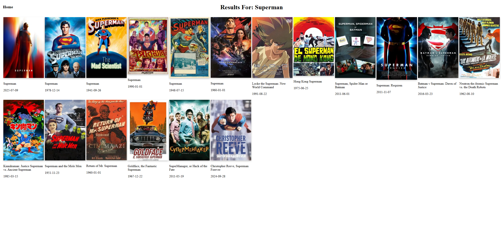

# 🎬 Movie Recommendation Website

A full-stack web application that lets users browse and discover movies/shows using real-time data from the **TMDb API**.  
Built with **Python (Flask)** on the backend and **HTML/CSS/JavaScript** on the frontend.  

---

## ✨ Features
- 🔍 Search movies/shows by **name** or **genre**  
- 📊 Browse **trending movies/shows** updated in real time  
- 🎨 Responsive design with clean UI/UX  
- ⚡ Dynamic content rendered with Flask + TMDb API  

---

## 🛠️ Tech Stack
- **Backend**: Python, Flask  
- **Frontend**: HTML, CSS, JavaScript  
- **API**: [TMDb API](https://www.themoviedb.org/documentation/api)  
- **Data Format**: JSON  

## 📸 Screenshots

### 1) Homepage — Trending feed

**What it shows:** Home page with a top nav + search bar and two horizontal rails:
**Trending Movies** and **Trending Shows**. Each tile displays the poster, title, and
rating (star + score). Data comes live from TMDb; sections paginate/scroll for more titles.

### 2) Genres — Filter picker

**What it shows:** A clean genre selector with 20+ pill buttons (Action, Drama, Sci-Fi, etc.).
Users pick one or more genres and hit **Submit**. This triggers a TMDb discover request using
the selected genre IDs.

### 3) Genres — Results list (after submit)

**What it shows:** Genre-filtered results in a readable list layout. Each card includes a poster,
bolded title, release date (italicized), and an overview snippet. Cards are spaced with soft
shadows for scannability.

### 4) Search — Query results grid

**What it shows:** Grid of movies returned for the query **“Superman.”** Each tile shows the
poster, title, and release date. Powered by the TMDb Search endpoint; responsive layout adapts
to screen width.

---
